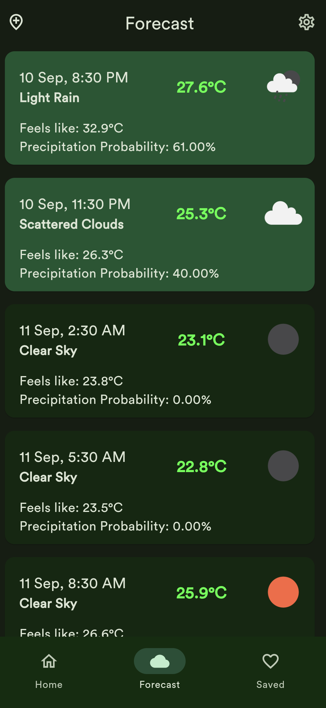
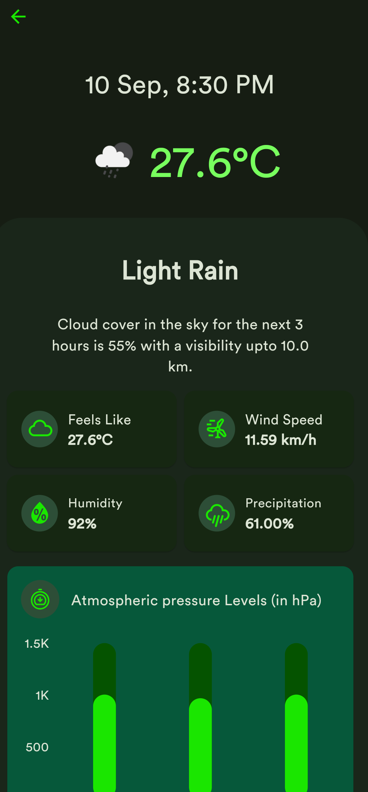
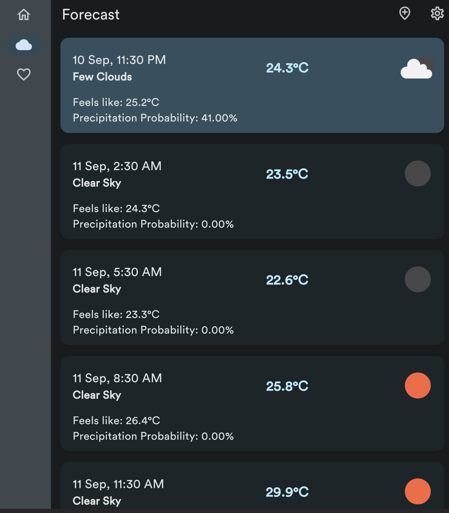

# WeatherWise App

[](https://opensource.org/licenses/MIT)


More than analysis, climate experiments. Capture unique moments and see how time transforms your memories into powerful visual data.

## 📸 Visual Preview

<div align="center">
  
   
  
</div>

## ✨ Key Features

| Feature | Description |
|---------|-------------|
| **Core Functionality** | Brief description | 
| **Advanced Controls** | Special capabilities |
| **Customization** | Personalization options | 

## 🚀 Getting Started

### Prerequisites
- Flutter 3.13+
- Dart 3.1+
- [Any other requirements]

### Installation
```bash
git clone https://github.com/yourusername/project.git
cd project
flutter pub get
flutter run
